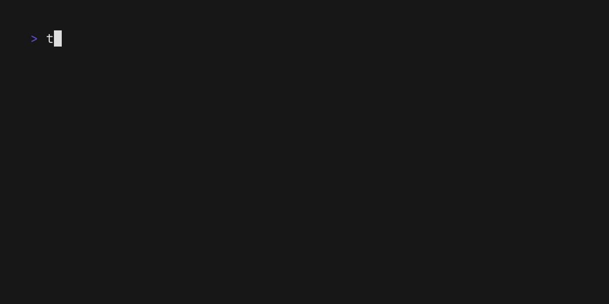

<div align="center">
  <h1>Toshokan (図書館 Library)</h1>
  CLI tool for interacting with your Steam library on Linux

  
</div>

## Usage

```shell
# refer to --help for list of commands
toshokan --help

# and how to use each command
toshokan <COMMAND> --help
```

## Development

```shell
# build
cargo build

# run
cargo run -- <ARGS>
```

## License

Distributed under the GNU GPLv3 License. See `LICENSE` for more information.
